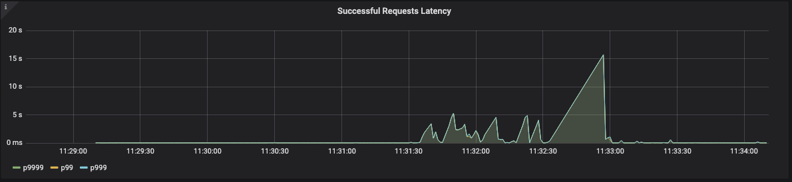
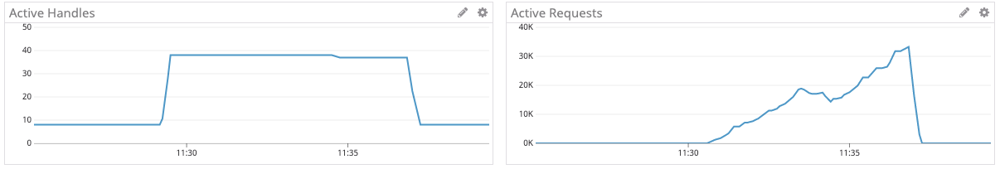
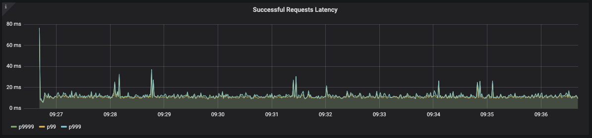
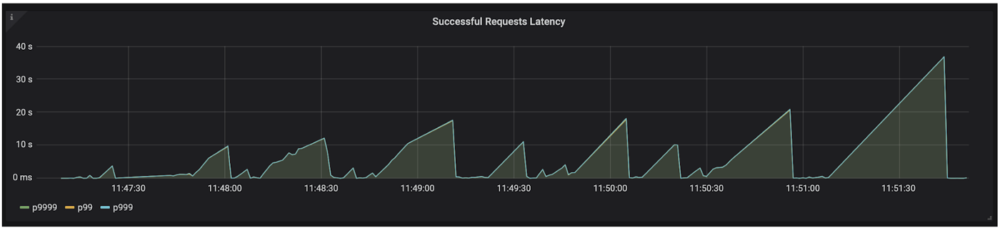
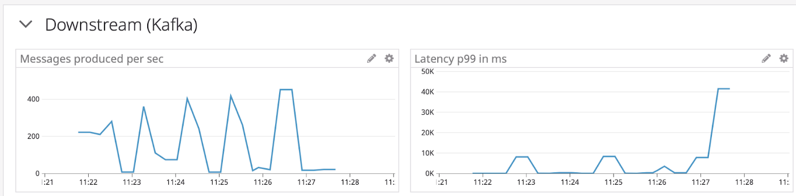
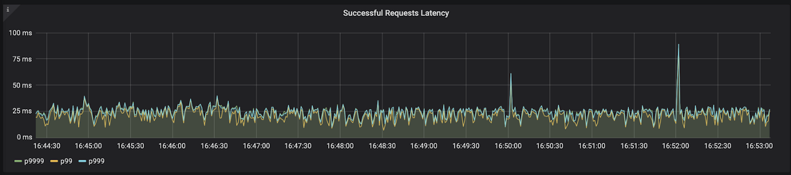

# 6 Lessons learned from optimizing the performance of a Node.js service

(Photo by Jacqueline Kelly on Unsplash)

Here at Klarna, we put a lot of effort into empowering our developers to deliver high-quality and secure services. One of the services we provide our developers with is a platform for running A/B tests. A critical component of this platform is a fleet of processes that for every incoming request, makes the decision: which flavor of the test (A or B) to expose the request to. That, in turn, determines what color to render a button, what layout to show the user, or even which 3rd party backend to use. These decisions have a direct impact on user experience.

The performance of each process in this fleet is critical since it is used synchronously in the critical decision paths in the Klarna ecosystem. A typical requirement in such flows is to decide within a single-digit latency for 99.9% of the requests. To be confident that we keep adhering to these requirements, we developed a performance testing pipeline to load test this service.

### Takeaway #1: performance testing can give us confidence that we are not degrading performance with each release.

Although we barely saw any performance issues in two years that this platform is in production, the tests were unambiguously showing some issues. Several minutes into the test, at a moderate and stable request rate, the request duration spikes up from its normal range to several seconds:

We decided that although this did not happen in production yet, it was just a matter of time until the real-life load "catches up" with the synthesized load, and therefore, this is something worth investigating.

### Takeaway #2: by "cranking up" the load we can expose problems before they ever reach production.

Another thing to note is that it takes around two or three minutes for the problems to appear. In the first iterations, we ran this test for only two minutes. Only after extending the duration of the test to ten minutes, we discovered this problem.

### Takeaway #3: long load tests can surface different kinds of problems. If everything looks OK, try extending the duration of the test.

We normally monitor services using the following metrics: number of incoming requests per second, duration of incoming requests, and the error rate. These give a pretty good indication of whether the service is experiencing problems or not.

But these metrics do not offer any insights when the service misbehaves. When things go wrong, you need to know where the bottleneck is. For that, you need to monitor the resources that the Node.js runtime uses. The obvious ones are CPU and memory utilization. But sometimes these are not the actual bottlenecks. In our case, the CPU utilization was low, and the memory utilization was low as well.

Another resource that Node.js uses is the event loop. In the same way we need to know how many megabytes of memory the process is using, we also need to know how many "tasks" the event loop needs to handle. The event loop is implemented in a C library called "libuv" ([here](https://www.youtube.com/watch?v=GE6MpnxhW_Q) is a great talk about the event loop by Kenneth Gibson). The term it uses for these "tasks" is Active Requests. Another important metric to follow is the number of Active Handles, which is the number of open file handles or sockets that the Node.js process holds (for a complete list of the kinds of handles, see the [libuv documentation](http://docs.libuv.org/en/v1.x/handle.html#c.uv_handle_type)). So if the test is using 30 connections, it would make sense to see around 30 Active Handles. Active Requests is the number of operations pending on these Handles. Which operations? The full list is available in the [libuv documentation](http://docs.libuv.org/en/v1.x/request.html#c.uv_req_t.type), but these can be read/write operations, for example.

Looking at the metrics reported by the service, there was something wrong. While the number of active handles is what we would expect (around 30 in this test), the number of active requests was disproportionately large - several tens of thousands:

We still didn't know which types of requests were in the queue, though. After breaking down the number of active requests by their type, the picture was clearer. One type of request stood out in the reported metrics: UV_GETADDRINFO. This type of request is generated when Node.js is attempting to resolve a DNS name.

But why would it generate so many DNS resolution requests? Turns out that the [StatsD client we are using](https://github.com/brightcove/hot-shots/) attempts to resolve the hostname for each outgoing message. To be fair, it does offer an option to cache the DNS results, but that option does not respect the TTL of that DNS record - it caches the results indefinitely. So if that record is updated after the client already resolved it, the client will never be aware of it. Since the StatsD load balancer might be redeployed with a different IP, and we cannot force a restart of our service to update the DNS cache, this approach of indefinitely caching the results was not an option for us.

The solution we came up with was to add proper DNS caching outside of the client. It's not hard to do by monkey patching the "DNS" module. And the results were better:

### Takeaway #4: don't forget to consider DNS resolution when thinking about outgoing requests. And don't ignore the record's TTL - it can literally break your app.

After solving this problem, we re-enabled some more features in the service and tested again. Specifically, we enabled a piece of logic that produces a message to a Kafka topic for every incoming request. The tests revealed, again, significant spikes in response time (seconds) for significant periods:

Looking at the metrics from the service showed an obvious problem in that very feature we just enabled - the latency of producing messages to Kafka was extremely high:

We decided to try a trivial improvement - queuing the outgoing messages in memory and flushing them in a batch every second. Running the test again, we saw a clear improvement in the response times of the service:

### Takeaway #5: batch I/O operations! Even when async, I/O is expensive.

Final note: running the tests mentioned above would have been impossible without a way to run tests with reproducible and consistent results. The first iterations of our performance testing pipeline did not provide us confidence in their results since they were not consistent. Investing in a proper testing pipeline allowed us to try out things, experiment with fixes, and mostly be confident that the numbers we are looking at are not coincidental.

### Takeaway #6: before attempting any improvements, you should have a test that you trust its results.

EDIT: I've received some questions about which tools were used to perform the tests here. There are a couple of tools used here:
The load is generated by an internal tool which simplified running Locust in [distributed mode](https://docs.locust.io/en/stable/running-locust-distributed.html). Basically we just need to run a single command and that tool will spin up the load generators, provide them with the test script, and collect the results to a dashboard in Grafana. These are the black screenshots in the article. This is the perspective of the (client) in the tests.

The service under test is reporting metrics to Datadog. These are the white screenshots in the article.
